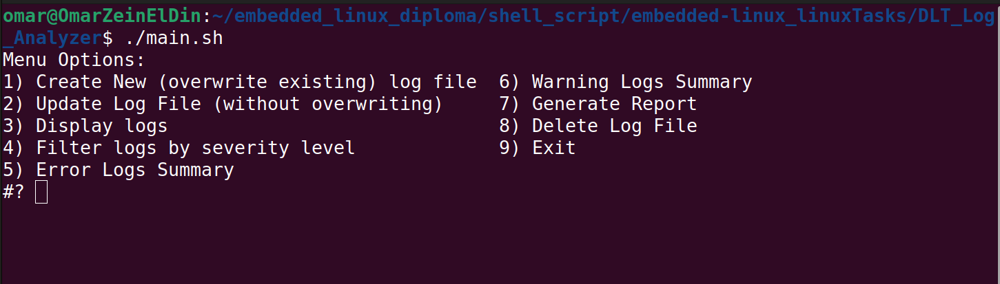
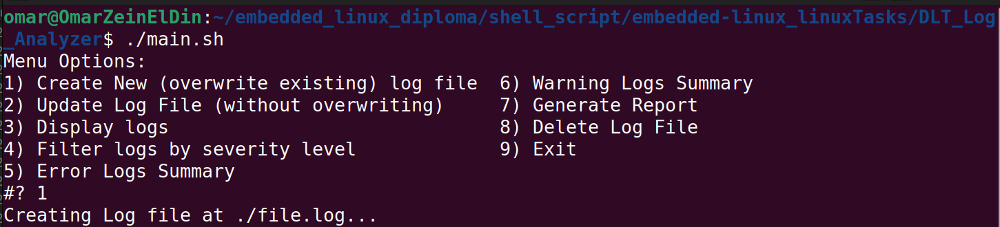
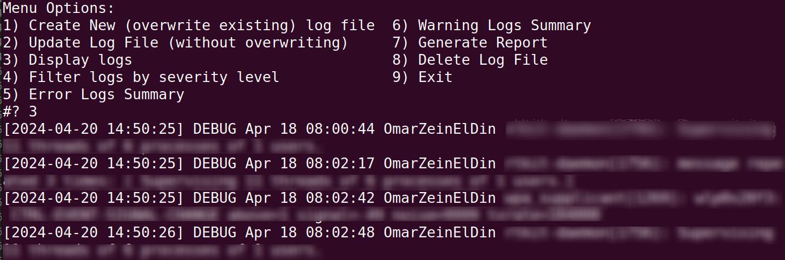
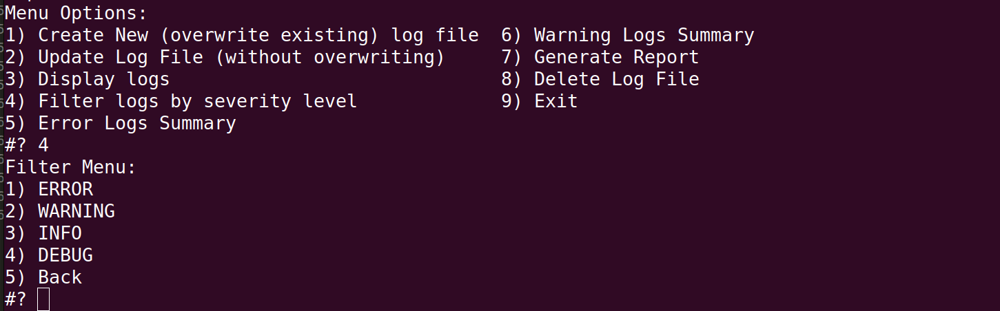
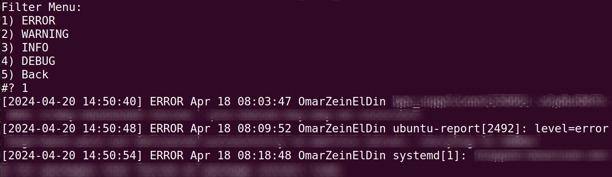
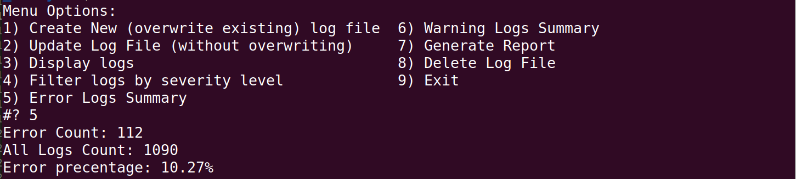
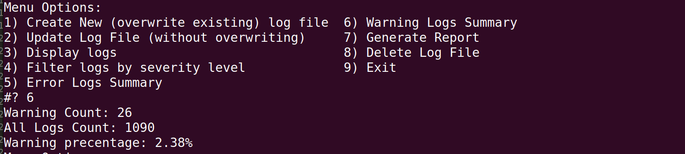
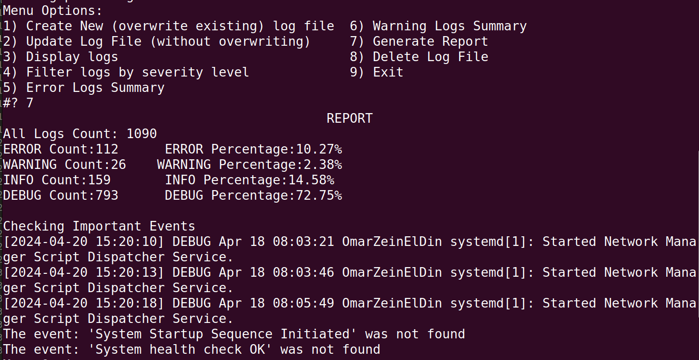
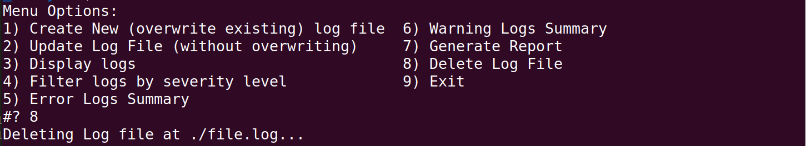

# DLT Log Analyzer

## Project Overview

The DLT Log Analyzer is a Bash script designed to analyze system log files, by default located in "/var/log/syslog". However, you have the flexibility to edit the log file location or include additional system files by configuring the `config.conf` file.

The script uses keywords defined in the `config.conf` file to determine the severity level of each log message. It then compiles these messages into a Diagnostic Log and Trace (DLT) file format. An example format of the DLT file is as follows:

``` bash
[2024-04-06 08:15:32] INFO System Startup Sequence Initiated
[2024-04-06 08:15:34] WARN Deprecated API usage detected: api_v1_backup
[2024-04-06 08:16:01] ERROR Unable to initialize network interface: eth0
[2024-04-06 08:16:05] INFO Network interface initialized successfully: eth1
[2024-04-06 08:17:42] DEBUG Process A started with PID: 1234
[2024-04-06 08:18:03] WARN Memory usage exceeds threshold: 85%
[2024-04-06 08:19:10] ERROR Disk write failure on device: /dev/sda1
[2024-04-06 08:20:00] INFO System health check OK
```

Additionally, the script automates the process of analyzing DLT files, providing functionalities to parse, filter, and summarize the log data.

## Features

### Log Analysis

The script parses system log files and identifies log messages based on predefined keywords.

### Severity Level Detection

Determines the severity level (INFO, WARN, ERROR, DEBUG) of each log message.

### Log Parsing

Extracts key information from each log entry, including timestamp, log level, and message content.

### Filtering

Provides options to filter log entries by log level, allowing users to focus on specific types of messages.

### Error and Warning Summary

Summarizes errors and warnings encountered in the log, providing counts and details for each type.

### Event Tracking

Tracks specific events within the log files, ensuring critical processes are starting and completing as expected.

### Report Generation

Generates a comprehensive report summarizing the findings from the log analysis. This report includes any identified trends in error/warning logs and the status of system events.

## Usage

To use the DLT Log Analyzer:

1. Ensure the `config.conf` file is properly configured with relevant keywords and settings.
2. Run the script with appropriate permissions and parameters.
3. Review the generated DLT file and analysis report for insights into system log data.

## Screenshots

### Interface View



### Creating a DLT File



### Display DLT File Content on Screen



### Filter DLT File by Severity Level

#### Filter Menu



#### Filtering By Error (for example)



### Error Log Summary



### Warning Log Summary



### Report Generation for the DLT File



### Delete DLT File


