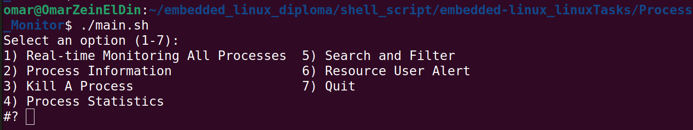
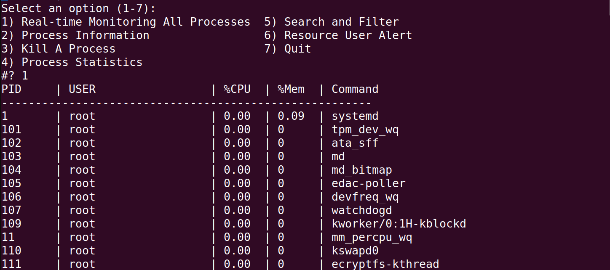
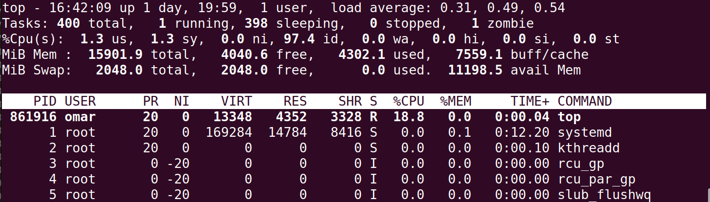
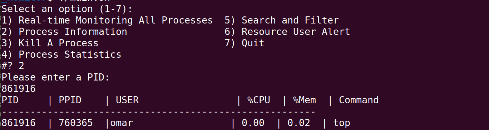
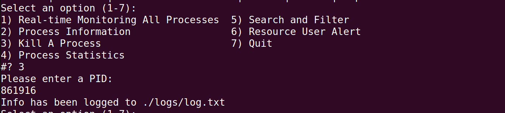
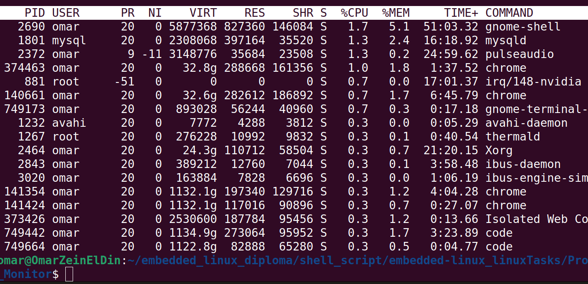
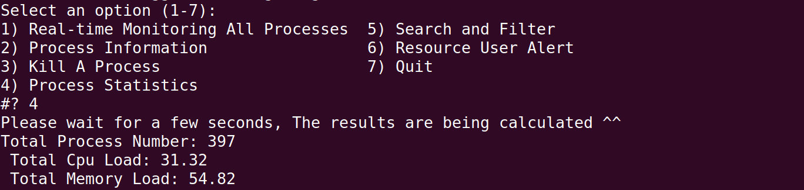
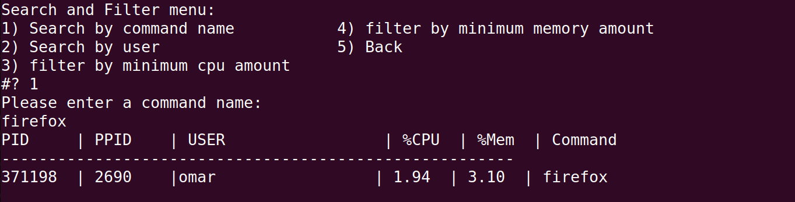
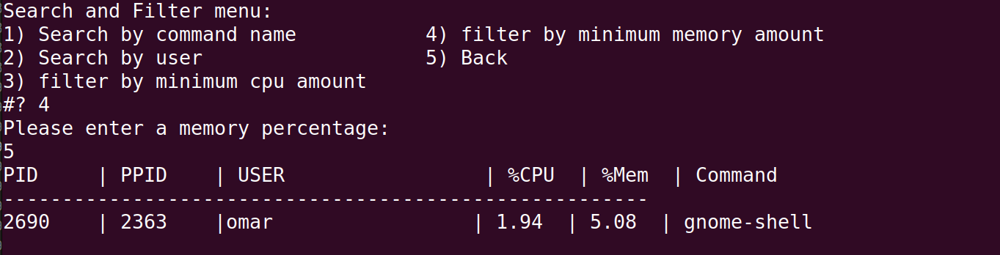

# Task Details

- Task Provider: Eng. Hazem Khaled
- Bash Project Idea: Process Monitor

- Project Overview
Create a Bash script that serves as a simple process monitor, allowing users to view, manage, and analyze running processes on a Unix-like system.

- Features
  - List Running Processes:

  - Implement functionality to list all running processes with essential information (PID, name, CPU/Memory usage).

1. Process Information:
Provide detailed information about a specific process, including its PID, parent process ID, user, CPU and memory usage, etc.

2. Kill a Process:
Allow users to terminate a specific process by entering its PID.

3. Process Statistics:
Display overall system process statistics, such as the total number of processes, memory usage, and CPU load.

4. Real-time Monitoring:
Implement real-time monitoring, updating the display at regular intervals to show the latest process information.

5. Search and Filter:
Allow users to search for processes based on criteria such as name, user, or resource usage.

6. Interactive Mode:
Implement an interactive mode where users can choose operations from a menu.

7. Resource Usage Alerts:
Set up alerts for processes exceeding predefined resource usage thresholds.

8. Logging:
Include logging features to record process-related activities, especially when a process is terminated.

9. Configuration Options:
Allow users to configure the script through a configuration file. For example, users might specify the update interval, alert thresholds, etc.

- Configuration File
Users can create a configuration file (e.g., process_monitor.conf) with settings like:
  - Sample configuration file for Process Monitor

    ``` bash
    # Update interval in seconds
    UPDATE_INTERVAL=5

    # CPU usage threshold for alerts (percentage)
    CPU_ALERT_THRESHOLD=90

    # Memory usage threshold for alerts (percentage)
    MEMORY_ALERT_THRESHOLD=80

    ```

## Screenshots

1. **Interface Menu**
   

2. **Real-time Monitoring All Processes**
   

3. **Process Information**
   - **Creating a New Process**
     
   - **Get Process Information by PID**
     

4. **Kill a Process**
   - **Kill the Process**
     
   - **Confirmation of Process Termination**
     

5. **Print Process Statistics**
   

6. **Search and Filter Menu**
   

7. **Example on Search (Search by Command Name)**
   

8. **Example on Filtering (Filter by Memory Usage)**
   
